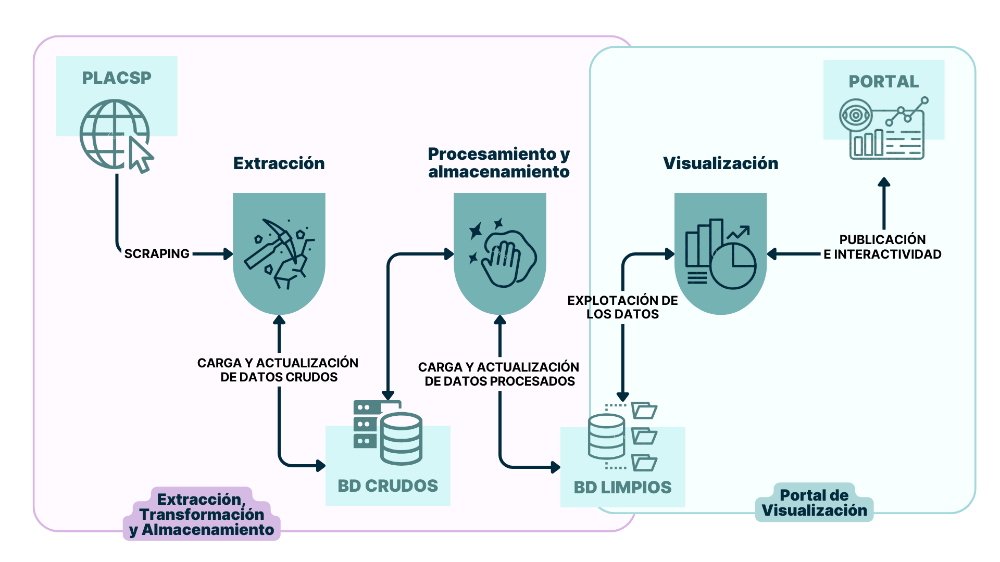

# Minería y Visualización de Datos de Contratación Pública del Estado

En este repositorio se encuentra todo el código relacionado con el Trabajo de Fin de Grado "Minería y Visualización de Datos de Contratación Pública del Estado" desarrollado por Miguel Azores Picón en el Grado en Ingeniería de Robótica Software.

## Resumen del Proyecto

Este proyecto ha consistido en desarrollar un conjunto de herramientas que mejoren el acceso a la información y la explotación de los datos de contratación pública. Para ello, se han desarrollado varias herramientas que permiten extraer, almacenar y visualizar datos de la Plataforma de Contratación del Sector Público (PLACSP). Estas tres herramientas son independientes y pueden funcionar por separado o de manera conjunta según el propósito deseado.

Con el fin de mostrar la utilidad de las mismas, se han desarrollado dos prototipos de
aplicaciones que las integran. El Portal de Visualización de Datos está orientado a cualquier
ciudadano y permite visualizar los datos de contratación de forma interactiva y accesible.
El segundo prototipo desarrollado tiene como usuario objetivo a investigadores y permite
la extracción, almacenamiento y visualización de los datos de cualquier órgano de contratación de forma automática.

El proyecto ha sido diseñado y desarrollado como parte del Trabajo de Fin de Grado en Ingeniería de Robótica Software. Parte de la idea de implementar una herramienta que mejore la transparencia y el acceso a los datos de la administración pública mediante el uso de tecnologías avanzadas, poniendo en práctica y ampliando todo lo aprendido durante el grado en lo que se refiere a desarrollo software, automatización de procesos y sistemas robóticos digitales.

## Esquema General de las Aplicaciones

En el siguiente diagrama se pueden observar los tres módulos, extracción, almacenamiento y visualización de datos interaccionando con el resto de elementos del sistema: la PLACSP, las bases de datos y la visualización web. Además, se puede ver un esquema de la herramienta completa y de cada uno de los prototipos implementados.

